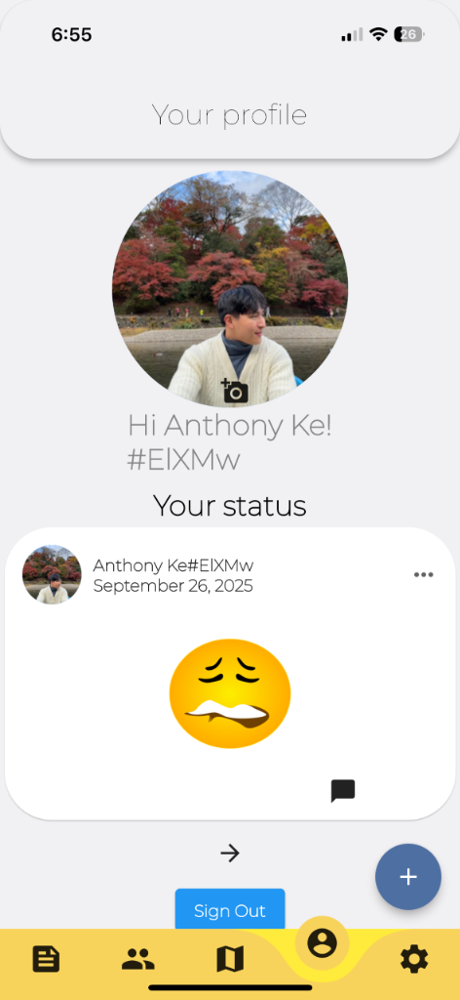
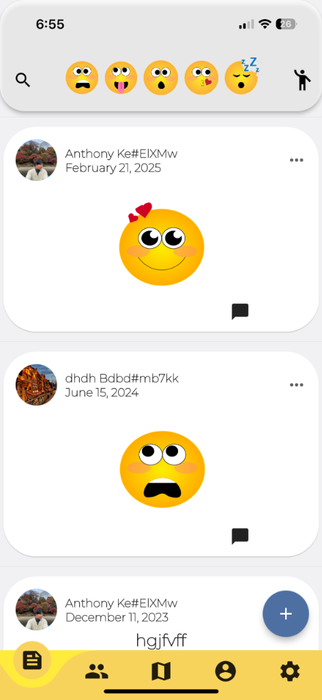
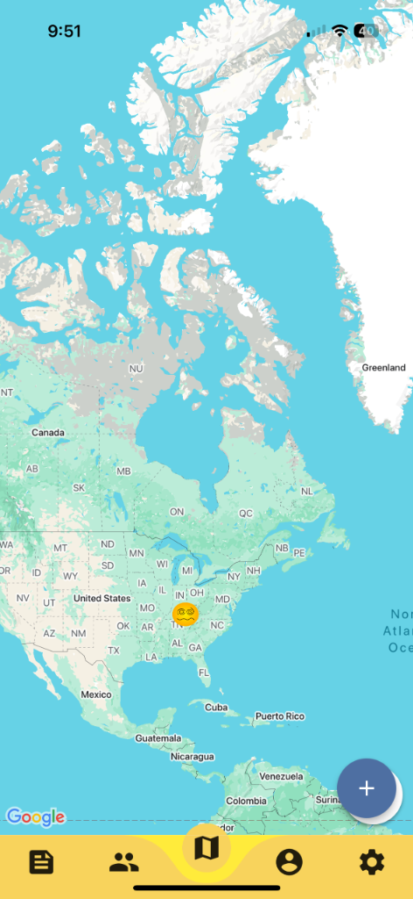
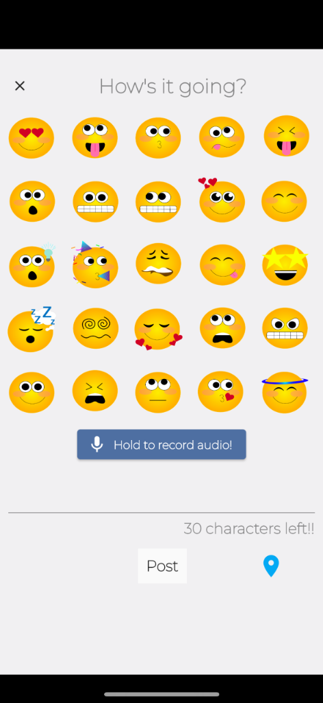

# MooodApp

MooodApp is a location-aware, social mood-tracking application built with Flutter. It connects users with their friends by sharing their current moods, activities, and locations in real-time.

<div style="display:flex; flex-wrap:wrap; gap:10px;">
  
  
  
  
</div>

## Features
- **Real-Time Mood Sharing**: Express your mood and view friends' moods using custom emoji statuses.
- **Location & Map Integration**: See where your friends are checking in via Google Maps integration.
- **Social Connectivity**: Add friends, view their profiles, and stay connected.
- **Media Support**: Send and receive images and audio streams (using `image_picker` and `sound_stream`).
- **Firebase Backend**: Fully powered by Firebase for Authentication, Cloud Firestore (database), and Cloud Storage.

## Prerequisites
- [Flutter SDK](https://docs.flutter.dev/get-started/install) (>= 2.12.0 < 3.0.0)
- Platform-specific build tools (Android Studio / Xcode)
- A Firebase Project
- A Google Maps API Key

## Setup Instructions

### 1. Clone the Repository
```bash
git clone git@github.com-keanthon:keanthon/MooodApp.git
cd MooodApp
```

### 2. Install Dependencies
```bash
flutter pub get
```

### 3. Configure API Keys
The repository does not include the sensitive API keys required to run the map and backend services. You must configure them yourself:

**Google Maps:**
- **Android**: Put your Google Maps API key in `android/app/src/main/AndroidManifest.xml` where you see `YOUR_API_KEY_HERE`.
- **iOS**: Put your Google Maps API key in `ios/Runner/AppDelegate.swift` replacing `YOUR_API_KEY_HERE`.

**Firebase:**
- Download your `google-services.json` from the Firebase Console and place it in `android/app/`. Make sure the `package_name` in Firebase matches `com.example.moood`.
- Follow the equivalent setup for iOS by placing your `GoogleService-Info.plist` in the `ios/Runner/` directory via Xcode.

### 4. Run the Application
Connect a device or start an emulator/simulator, then run:
```bash
flutter run
```
